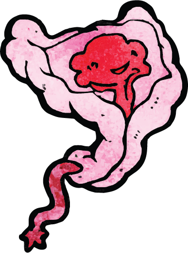
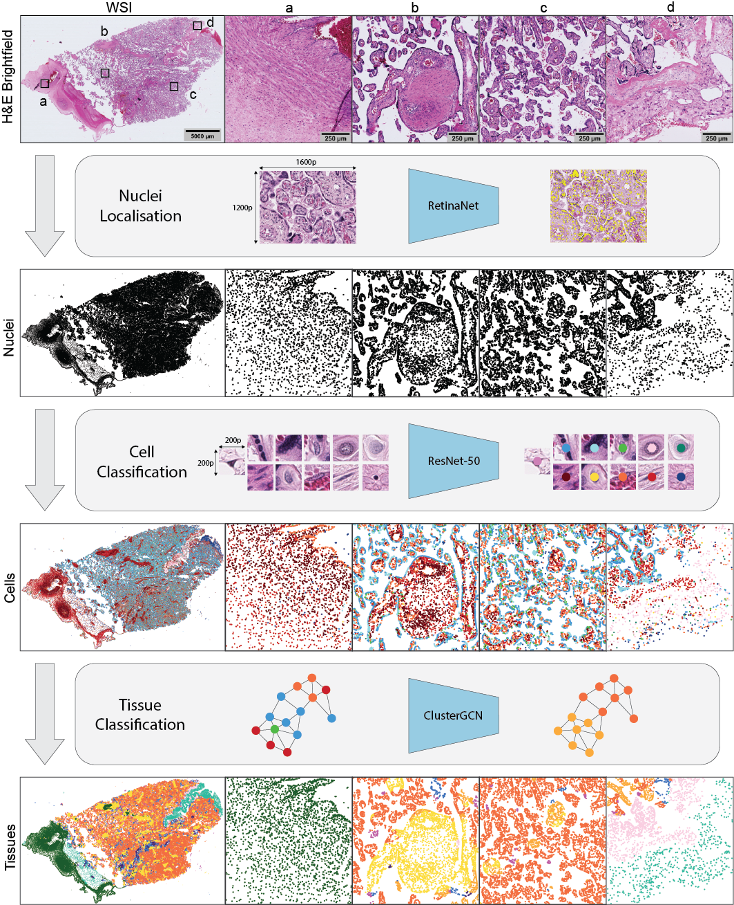
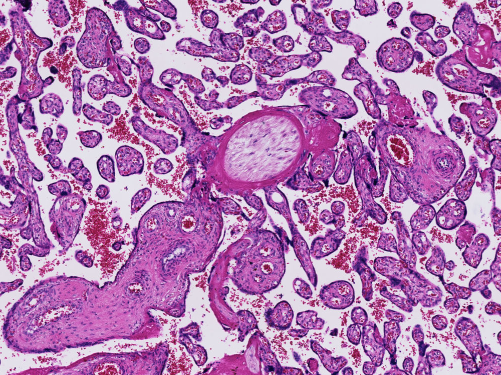

# Histology Analysis Pipeline.py (HAPPY) 

## Overview

Accompanying repository for **HAPPY: A deep learning pipeline for mapping cell-to-tissue 
graphs across placenta histology whole slide images**. 



**Abstract**: _Accurate placenta pathology assessment is essential for managing maternal 
and newborn health, but the placenta's heterogeneity and temporal variability pose 
challenges for histology analysis. To address this issue, we developed the 
‘Histology Analysis Pipeline.PY’ (HAPPY), a deep learning hierarchical method for 
quantifying the variability of cells and micro-anatomical tissue structures across 
placenta histology whole slide images. HAPPY differs from patch-based features or 
segmentation approaches by following an interpretable biological hierarchy, representing 
cells and cellular communities within tissues at a single-cell resolution across whole 
slide images. We present a set of quantitative metrics from healthy term placentas as a 
baseline for future assessments of placenta health and we show how these metrics deviate 
in placentas with clinically significant placental infarction. HAPPY’s cell and tissue 
predictions closely replicate those from independent clinical experts and placental 
biology literature._

This repo contains all code for training, evaluating, and running inference across 
WSIs using the three stage deep learning pipeline detailed in the paper. The three 
deep learning steps are: **nuclei detection**, **cell classification** and **tissue 
classification**.

## Installation

Our codebase is writen in python=3.10 and has been tested on Ubuntu 20.04.2 (WSL2), 
MacOS 11.1, and CentOS 7.9.2009 using both an NVIDIA A100 GPU and a CPU

You will first need to install the vips C binaries. The libvips documentation lists
installation instructions [here](https://github.com/libvips/libvips/wiki) for different 
OSs. If you are using MacOS you may brew install with:

```bash
brew install vips --with-cfitsio --with-imagemagick --with-openexr --with-openslide --with-webp
```

If you are on Ubuntu you may apt get:

```bash
sudo apt install libvips
```

For all remaining Python source code and dependencies, we recommend installation 
using the MakeFile. Installation should only take a few minutes.

```bash
git clone git@github.com:Nellaker-group/happy.git
cd happy
# Activate conda or venv environment with python installation:
# e.g. conda create -y -n happy python=3.10
#      conda activate happy
make environment_cu117
```
The make command will run the following:

```bash
pip install torch==2.0.1+cu117 torchvision==0.15.2+cu117 torchaudio==2.0.2 --index-url https://download.pytorch.org/whl/cu117
pip install torch_geometric==2.3.1	
pip install pyg_lib torch_scatter torch_sparse torch_cluster torch_spline_conv -f https://data.pyg.org/whl/torch-2.0.0+cu117.html
pip install -r requirements.txt
pip install pyvips==2.1.14
pip install -e .
```
If you would rather install a different version of pytorch for your cuda version, 
please change the first two lines as per library instructions.

### Troubleshooting

Installing javabridge can sometimes be a little tricky on MacOS. If you get a 
'jvm not found' or 'jni.h not found' style error then you need to locate your 
java installation and export it. For example, if you installed java with homebrew you 
can:

```bash
export JAVA_HOME=/usr/local/opt/openjdk
```

If you then get a error with 'module = PyImport_ImportModuleLevelObject' you can 
install this fork of javabridge which fixes it:

```bash
pip install git+https://github.com/LeeKamentsky/python-javabridge.git#egg=javabridge
```


## Project Setup

The core code is organ-agnostic and may be used for any organ histology analysis. 
Organ-specific cell and tissue data may be added to `happy/organs.py`. We recommend
extending the core happy code by adding a new project to `projects/{project_name}`, 
using `projects/placenta` as a template.

If you would like to use the placenta histology training data and trained models from 
the paper, you may download the data from [this link](https://drive.google.com/drive/folders/1RvSQOxsWyUHf_SGV1Jzqa_Gc5QI4wQoy?usp=sharing). 
Keeping the same directory structure as in the link, place each directory into 
`projects/placenta`. This will allow you to train and evaluate all three models. For
a WSI inference demo, place the sample WSI section under 
`projects/placenta/slides/sample_wsi.tif`. We explain how to run the full 
inference pipeline across this WSI in the 3rd section.

## Training

### Nuclei Detection Training

Placenta nuclei detection training data from the paper should be placed under 
`projects/placenta/datasets/nuclei/` with annotations in 
`projects/placenta/annotations/nuclei/`. This data is split into respective data 
collection sources (i.e. 'hmc', 'uot', 'nuh') which are combined during training.

To train the nuclei detection model, run:

```bash
python nuc_train.py --project-name placenta --exp-name demo-train --annot-dir annotations/nuclei --dataset-names hmc --dataset-names uot --dataset-names empty --decay-gamma 0.5 --init-from-inc --frozen
```

We recommend first fine tuning the model pretrained on the coco dataset using commands
`--frozen --init-from-inc`. Then loading the fine tuned model and training 
unfrozen using `--pre-trained {path} --no-frozen --no-init-from-inc`.

### Cell Classification Training

Placenta cell classification training data from the paper should be placed under 
`projects/placenta/datasets/cell_class/` with annotations in 
`projects/placenta/annotations/cell_class/`. This data is split into respective data 
collection sources (i.e. 'hmc', 'uot', 'nuh') which are combined during training.

To train the cell classification model, run:

```bash
python cell_train.py --project-name placenta --organ-name placenta --exp-name demo-train --annot-dir annotations/cell_class --dataset-names hmc --dataset-names uot --dataset-names nuh --decay-gamma 0.5 --init-from-inc --frozen
```

As with the nuclei detection model, we recommend first fine tuning the model pretrained 
on the imagenet dataset using commands `--frozen --init-from-inc`. Then loading the 
fine tuned model and training unfrozen using 
`--pre-trained {path} --no-frozen --no-init-from-inc`.

### Tissue Classification Training

By default, the training script will mask any nodes that are within the regions 
specified by validation and/or test .csv files within `graph_splits/` as validation
and/or test nodes. All other nodes will be marked as training nodes.  

We provide the training data and ground truth annotations for training the graph model 
across the cell graphs of two placenta WSIs, as per the paper. The training data should 
be placed under `projects/placenta/embeddings/` and the ground truth annotations in 
under `projects/placenta/annotations/graph`.

To train the graph tissue model on this data, run:

```bash
python graph_train.py --project-name placenta --organ-name placenta --run-ids 1 --run-ids 2 --annot-tsvs wsi_1.tsv --annot-tsvs wsi_2.tsv --exp-name demo_train --val-patch-files val_patches.csv --test-patch-files test_patches.csv
```

### Making Custom Training Data

We provide utility scripts for generating your own training data. 

**Nuclei Detection and Cell Classification:**
If you have used QuPath to create cell point annotations within boxes, you may use 
`qupath/GetPointsInBox.groovy` to extract a .csv of these ground truth points and
classes. From this .csv, you may use `happpy/microscopefile/make_tile_dataset.py` to
generate a dataset of tile images and train/val/test split annotation files from your
annotations for both nuclei detection and cell classification. 

**Tissue Classification:** In Qupath, if you load nuclei predictions onto your desired
WSI and draw polygon boundaries around different structures, you may use 
`qupath/cellPointsToTissues.groovy` to extract those points with ground truth tissue
labels. 

## Evaluation

We provide evaluation scripts for checking model performance on validation or test 
data for each of the three models under `analysis/evaluation/`. The nuclei detection
model can be evaluated using `evaluate_nuclei_model.py`, the cell classification model 
can be evaluated using `evaluate_cell_model.py`, and the graph tissue model can be
evaluated using `evaluate_graph_model.py`.

## WSI Inference Pipeline

### Adding WSIs to the Database

You may add WSIs to the database using `happy/db/add_slides.py`. This will add all
slides with the specified file format at the specified directory to the database. We 
supply a starting database in github which contains two entries in the Slide and 
EvalRun tables to allow for training and evaluation of the graph model, as per the 
paper. 

### Adding Trained Models to the Database

You may add trained models to the database using `happy/db/add_model.py`. The sample 
starting database in github already contains data for both pretrained nuclei and 
cell models from the paper. They have model IDs 1 and 2 respectively.

### Cell Pipeline

The cell pipeline `cell_inference.py` will run both nuclei detection and cell 
classification across a WSI. It will save each 'run' over a WSI into the Evalruns table 
in the database with respective predictions in the Predictions table. 
Each run can be stopped and restarted at any time. See the demo below for an example.

You may extract nuclei and cell predictions into a .tsv which QuPath can read using 
`qupath/coord_to_tsv.py`.

### Tissue Pipeline

Once you have nuclei and cell predictions, you may run the tissue pipeline 
`graph_inference.py`. This will construct a cell graph across the WSI and run the 
graph model. The pipeline will save a visualisation of tissue predictions and a .tsv 
file containing these predictions at the location of the trained model. See the demo
below for an example. 

### Demo Walkthrough



Add the demo slide section at `projects/placenta/slides/sample_wsi.tif` to 
the database using:

```bash
CWD=$(pwd) # save absolute current working directory
python happy/db/add_slides.py --slides-dir "$CWD/projects/placenta/slides/" --lab-country na --primary-contact na --slide-file-format .tif --pixel-size 0.2277 
```

Run the nuclei and cell inference pipeline on this sample:

```bash
python cell_inference.py --project-name placenta --organ-name placenta --nuc-model-id 1 --cell-model-id 2 --slide-id 3 --cell-batch-size 100
```

Run the graph tissue inference pipeline on the nuclei and cell predictions:

```bash
python graph_inference.py --project-name placenta --organ-name placenta --pre-trained-path trained_models/graph_model.pt --run-id 3 
```

At the location of the graph model weights, you will find an `eval` directory which will
contain a visualisation of the tissue predictions and a .tsv file containing the 
predictions, which can be loaded into QuPath. In this case, these will be under 
`projects/placenta/trained_models/eval/`

## Visualisation

Along with the visualisation generated by `graph_inference.py`, we also provide scripts
for visualising nuclei ground truth over training data in 
`analysis/evaluation/vis_nuclei_predictions.py`, nuclei predictions over images in the 
training data in `analysis/evaluation/vis_groundtruth_nuclei.py`, regions of the cell
graph in `analysis/evaluation/vis_graph_patch.py`, and the ground truth tissue points 
in `analysis/evaluation/vis_groundtruth_graph.py`.