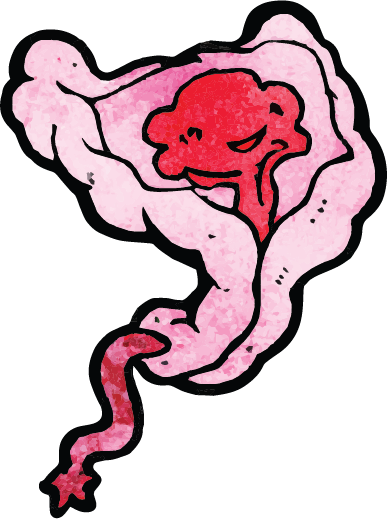
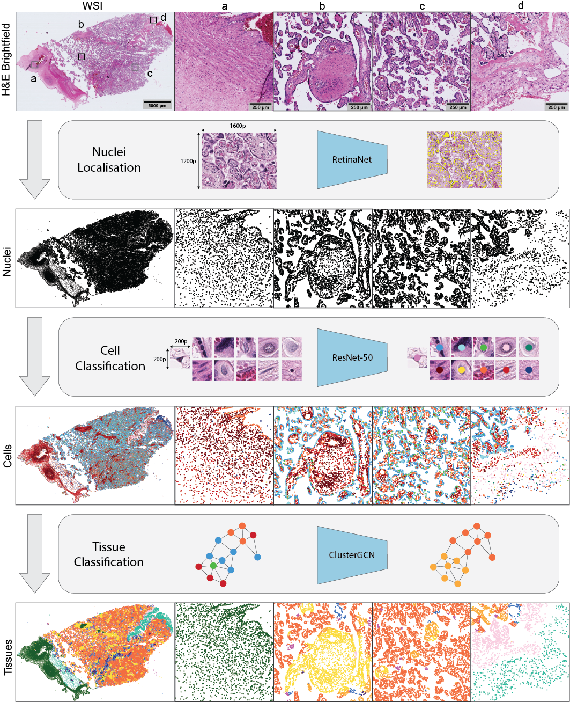

# Histology Analysis Pipeline.py (HAPPY) 

Accompanying repository for **HAPPY: A deep learning pipeline for mapping cell-to-tissue
graphs across placenta histology whole slide images**.

HAPPY is a three-stage deep learning pipeline for whole slide images (WSIs):

1. **Nuclei detection** — find every nucleus in the slide (YOLO detector)
2. **Cell classification** — classify each detected nucleus into a cell type (CNN)
3. **Tissue classification** — build a cell graph and label each cell's surrounding
   micro-anatomical tissue structure (graph neural network)

The core code is **organ-agnostic**; but trained and written for the placenta.

**Trained model weights** are now on [Hugging Face](https://huggingface.co/emrwlkr/HAPPY)!
Download with `python -m happy.db.download_models --project-name placenta` — see
[Using our trained models](#using-our-trained-models).

> **HAPPY v3.0 (June 2026):** debugged(!) tissue graph model, faster nuc inference, improved visualisations, core code is organ agnostic
> note nuclei inf/ training now uses YOLOv26. (inf still compatible with 
RetinaNet weights). NB database schema will need updating See [Update to HAPPY v3](#update-to-happy-v3).

> **HAPPY v2.0 (Sept 2025):** faster image fetching for nuclei/cell inference, a YOLO
> nuclei detector, and an improved graph tissue model. Tissue graph models trained with
> the old architecture are no longer compatible — retrain, or download the new placenta
> weights. See [Update to HAPPY v2](#update-to-happy-v2).

---

## Citation

If you use HAPPY, the code base, or the distributed models in your research, please cite the
original methods paper:

> Vanea, C., Džigurski, J., Rukins, V., Dodi, O., Siigur, S., Salumäe, L., Meir, K., Parks,
> W.T., Hochner-Celnikier, D., Fraser, A., Hochner, H., Laisk, T., Ernst, L.M., Lindgren, C.M.
> and Nellåker, C., 2024. Mapping cell-to-tissue graphs across human placenta histology whole
> slide images using deep learning with HAPPY. *Nature Communications*, 15(1), p.2710.

Much of the **v2/v3** work was developed after that paper.
If you use these versions or the models distributed with them, please also cite:

> Walker, E.C., Vanea, C., Meir, K., Hochner-Celnikier, D., Hochner, H., Laisk, T., Lindgren,
> C., Glastonbury, C.A., Ernst, L.M. and Nellaker, C., 2026. Biologically inspired digital
> histology for deep phenotyping of placental composition changes across major lesion types.
> *Placenta*.

---

## Contents

- [Overview](#overview)
- [Citation](#citation)
- [Installation](#installation)
- [Project setup](#project-setup)
- [Using the trained models? Skip to inference](#using-our-trained-models)
- [Creating ground truth data in QuPath](#creating-ground-truth-data-in-qupath)
- [Training](#training)
- [Evaluation](#evaluation)
- [WSI inference](#wsi-inference)
- [Multi-slide inference (avoiding SQLite locking)](#multi-slide-inference-avoiding-sqlite-locking)
- [Extracting metrics and downstream analysis](#extracting-metrics-and-downstream-analysis)
- [Visualisation](#visualisation)
- [Update to HAPPY v2](#update-to-happy-v2)
- [Update to HAPPY v3](#update-to-happy-v3)

---

## Overview



**Abstract**: _Accurate placenta pathology assessment is essential for managing maternal
and newborn health, but the placenta's heterogeneity and temporal variability pose
challenges for histology analysis. To address this issue, we developed the
'Histology Analysis Pipeline.PY' (HAPPY), a deep learning hierarchical method for
quantifying the variability of cells and micro-anatomical tissue structures across
placenta histology whole slide images. HAPPY differs from patch-based features or
segmentation approaches by following an interpretable biological hierarchy, representing
cells and cellular communities within tissues at a single-cell resolution across whole
slide images. We present a set of quantitative metrics from healthy term placentas as a
baseline for future assessments of placenta health and we show how these metrics deviate
in placentas with clinically significant placental infarction. HAPPY's cell and tissue
predictions closely replicate those from independent clinical experts and placental
biology literature._

This repo contains all code for training, evaluating, and running inference across WSIs.

---

## Installation

The codebase is written in Python 3.10 and has been tested on Ubuntu 20.04 (WSL2),
MacOS 15.1, and CentOS 7.9 using both an NVIDIA A100 GPU and CPU.

You will first need to install the vips C binaries. The libvips documentation lists
installation instructions [here](https://github.com/libvips/libvips/wiki) for different 
OSs:

```bash
# MacOS
brew install vips --with-openslide
# Ubuntu
sudo apt install libvips
```

Then install the Python package (takes a few minutes):

```bash
git clone git@github.com:Nellaker-group/happy.git
cd happy
# Activate venv environment with python installation:
python -m pip install --upgrade pip setuptools wheel
make environment_cu121          # GPU (CUDA 12.1); Makefile also has CPU / other CUDA targets
```

`make environment_cu121` runs:

```bash
pip install torch==2.1.2+cu121 torchvision==0.16.2+cu121 torchaudio==2.1.2 --index-url https://download.pytorch.org/whl/cu121
pip install torch_geometric==2.4.0
pip install pyg_lib torch_scatter torch_sparse torch_cluster torch_spline_conv -f https://data.pyg.org/whl/torch-2.1.0+cu121.html
pip install -r requirements.txt
pip install -e .
```

Change the first two lines for a different PyTorch/CUDA version if needed.
Makefile provides targets for CPU and different CUDA versions.

NB if having error `no module name 'happy'`, rerun `pip install -e .` in the root directory of the repo.

---

## Project setup

The core code is organ-agnostic. Add organ-specific cell and tissue definitions
(names, ids, colours) to [`happy/organs.py`](happy/organs.py), and add a project under
`projects/{project_name}/` using [`projects/placenta`](projects/placenta) as a template.

Specific organ processing required (e.g. grouping syn knots for placenta, live under project dir)

To reproduce the paper with placenta data and trained models, download the data from
[this link](https://drive.google.com/drive/folders/1RvSQOxsWyUHf_SGV1Jzqa_Gc5QI4wQoy?usp=sharing)
and place each directory into `projects/placenta`, keeping the same directory structure as in the link. For a WSI
inference [demo](#wsi-inference-pipeline), place the sample section at `projects/placenta/slides/sample_wsi.tif`.

HAPPY uses a small SQLite database (`happy/db/main.db`, via the Peewee ORM) to track
slides, trained models, and inference runs. A starter `main.db` is included. If you are
upgrading an older database to the current schema (HAPPYv3), run the migration (note just adds new columns and tables, and doesn't delete any existing data):

```bash
python -m happy.db.migrate_db_schema                 # migrates happy/db/main.db
python -m happy.db.migrate_db_schema --db-name /abs/path/to/other.db
```

---

## Using our trained models?

If you just want to run our placenta models on your own slides, you can **skip training
and ground-truth creation** and go straight to [WSI inference](#wsi-inference). Before
using the models on a new cohort we recommend validating them on a small amount of your
own ground truth using the [evaluation scripts](#evaluation).

!Update to HAPPY v3: yolo is now multi-organ for nuc detect

| Organ | YOLO F1 | YOLO P | YOLO R | RetinaNet F1 | RetinaNet P | RetinaNet R |
|---|---|---|---|---|---|---|
| Aorta | 0.923 | 0.870 | 0.983 | 0.889 | 0.899 | 0.879 |
| Brain cortex | 0.955 | 0.913 | 1.000 | 0.956 | 0.953 | 0.960 |
| Cervix ectocervix | 0.815 | 0.692 | 0.991 | 0.786 | 0.889 | 0.705 |
| Liver | 0.908 | 0.885 | 0.932 | 0.860 | 0.938 | 0.794 |
| Muscle skeletal | 0.931 | 0.871 | 1.000 | 0.786 | 1.000 | 0.648 |
| Ovary | 0.852 | 0.755 | 0.978 | 0.801 | 0.776 | 0.828 |
| Placenta | 0.899 | 0.857 | 0.946 | 0.852 | 0.838 | 0.866 |

**Cell classification** (placenta, 11 cell types; held-out test set of 2,743 cells):

| Metric | Value |
|---|---|
| Overall accuracy | 84.29% |
| Top-2 accuracy | 94.90% |
| Macro-averaged ROC AUC | 0.9773 |

**Tissue classification** (placenta, 9 tissue types; evaluated on 149,425 cell-graph nodes):

| Metric | Value |
|---|---|
| Overall accuracy | 68.34% |
| Top-2 accuracy | 91.14% |
| Top-3 accuracy | 97.10% |
| Macro-averaged ROC AUC | 0.8868 |

### Downloading the weights

Trained weights are hosted on the [Hugging Face Hub](https://huggingface.co/emrwlkr/HAPPY).
The shipped `main.db` already **registers these models by id**, so you just need to download
the weight files into the project's `trained_models/` dir — no manual registration required:

```bash
python -m happy.db.download_models --project-name placenta
```

This fetches all four weight files to `projects/placenta/trained_models/`, matching those register in the db. 

---

## Creating ground truth data in QuPath

Ground truth is annotated in [QuPath](https://qupath.github.io/) and exported to CSVs with
the Groovy/Python scripts in [`qupath/`](qupath). All annotation classes below are the
placenta defaults — rename them in the scripts (and in `happy/organs.py`) for other organs.

> The exact annotation classes the scripts expect are defined at the top of each Groovy
> script — edit those lists to match your QuPath project.

See [`qupath/README.md`](qupath/README.md) for more details on the QuPath scripts and how to create annotation data in QuPath.

### Nuclei detection and cell classification

Both models are trained from the same point annotations.

1. In QuPath, draw rectangle annotations of class **`TAnnot`** around the regions you want
   to annotate (these become the training tiles).
2. Inside those boxes, place **point** annotations, one class per cell type. The placenta
   classes are `CYT, HOF, SYN, FIB, VEN, VMY, MAT, WBC, MES, EVT, KNT, EPI, MAC`. 
3. Run [`qupath/GetPointsInBox.groovy`](qupath/GetPointsInBox.groovy) to export a CSV of the
   points (relative to each box) with their classes, to
   `projects/{project}/results/annotation_csvs/`.
4. Turn the CSV into tile images + train/val/test annotation splits (for both models):

   ```bash
   python happy/microscopefile/make_tile_dataset.py --help
   ```

### Tissue classification

Tissue labels come from cell points contained within hand-drawn tissue polygons.

1. In QuPath, load the nuclei/cell prediction points onto the WSI (export them from the db
   with [`qupath/coord_to_tsv.py`](qupath/coord_to_tsv.py) after running inference).
2. Draw **polygon** annotations around each tissue structure, using the tissue classes
   (placenta: `TVilli, SVilli, AVilli, MVilli, ImIVilli, MIVilli, Maternal, Chorion,
   Avascular, Fibrin, Sprout, Inflam`).
3. Run [`qupath/cellPointsToTissue.groovy`](qupath/cellPointsToTissue.groovy) to assign each
   point the class of its containing polygon (points outside all polygons become
   `Unlabelled`), exported to `projects/{project}/results/tissue_annots/` for tissue_train.py

---

## Training

The three models are trained in order (nuclei → cell → tissue). Commands below use the
placenta data; adapt paths/organ for your own.

### 1. Nuclei detection (YOLO)

Nuclei training data lives under `projects/placenta/dataset/nuclei/` as YOLO-format tiles +
labels, described by a dataset YAML.

**Preparing the data.** The QuPath export + [`make_tile_dataset.py`](happy/microscopefile/make_tile_dataset.py)
(see [Creating ground truth data in QuPath](#creating-ground-truth-data-in-qupath)) produce
tiles and annotation CSVs in **RetinaNet / COCO format** (`image_path,x1,y1,x2,y2,class_name`).
YOLO instead needs one normalised `.txt` label file per tile, so convert the CSVs first with
[`happy/data/datasets/yolo_coversion.py`](happy/data/datasets/yolo_coversion.py), then write the
dataset YAML (train/val/test image dirs + class names) with
[`happy/data/datasets/generate_yaml.py`](happy/data/datasets/generate_yaml.py). Both scripts
currently have their input/output paths hard-coded near the top — edit those for your dataset.

Then train with:

```bash
python nuc_train.py \
    --project-name placenta \
    --exp-name demo-nuc \
    --data projects/placenta/dataset/nuclei/placenta_nuclei.yaml \
    --model-name yolo26n.pt \
    --epochs 100 --batch 8 --imgsz 1280 \
    --single-cls \
    --add-to-db          # register the trained model in the db and print its model id
```

Pass `--data` multiple times to train a joint detector across organs. Model weights are
saved under `projects/placenta/results/nuclei/{exp_name}/{timestamp}/`.

### 2. Cell classification

```bash
python cell_train.py \
    --project-name placenta \
    --organ-name placenta \
    --exp-name demo-cell \
    --annot-dir annotations/cell_class \
    --dataset-names hmc --dataset-names uot --dataset-names nuh \
    --decay-gamma 0.5 \
    --frozen --init-from-inc \
    --add-to-db          # register the trained model in the db and print its model id
```

We recommend first fine-tuning from ImageNet weights (`--frozen --init-from-inc`), then
loading that model and training unfrozen with `--pre-trained {path} --no-frozen --no-init-from-inc`.

Register the trained nuclei/cell models in the db to get an id for inference:

```bash
python -m happy.db.add_model nucleus-cell \
    --path-to-model /abs/path/to/model.pt \
    --run-type Nuclei --run-name demo-nuc \
    --model-architecture yolo26 --model-performance 0.9 \
    --num-epochs 100 --batch-size 8 --init-lr 0.001
```

Both `nuc_train` and `cell_train` register the model automatically when you pass `--add-to-db`
(printing its id). Run `add_model nucleus-cell` yourself only to register an **existing** weights
file — e.g. one you downloaded rather than trained (use `--run-type Cell --model-architecture
resnet-50` for a cell model; `--run-type Nuclei --model-architecture yolo26 or retinanet` for nuc).

### 3. Tissue classification

Tissue training runs over the cell graphs of one or more inference runs (`--run-ids`), using
the ground-truth CSVs from QuPath (`--tissue-label-csv`, one per run id). Nodes inside the
regions in the `--val-patch-files` / `--test-patch-files` CSVs become val/test; the rest are
training nodes.

```bash
python tissue_train.py \
    --project-name placenta \
    --organ-name placenta \
    --exp-name demo-tissue \
    --run-ids 1 --run-ids 2 \
    --tissue-label-csv wsi_1_tissue_points.csv --tissue-label-csv wsi_2_tissue_points.csv \
    --val-patch-files val_patches.csv \
    --test-patch-files test_patches.csv \
    --layers 16 \
    --add-to-db          # register the final model as a GraphModel and print its id
```

This trains a supervised ClusterGCN (`sup_clustergcn`). Weights are saved under
`projects/placenta/results/graph/sup_clustergcn/{exp_name}/{timestamp}/`. Use `--db-name`
to point at a specific database, and `--custom-embeddings-path` if the embeddings live
outside the project dir.

`tissue_train --add-to-db` registers the model as a `GraphModel` automatically (printing its id).
Run `add_model tissue-model` yourself only to register an **existing** graph model — e.g. one you
downloaded rather than trained:

```bash
python -m happy.db.add_model tissue-model \
    --path-to-model /abs/path/to/final_graph_model.pt \
    --exp-name demo-tissue --model-type sup_clustergcn --organ placenta --performance 0.9
```

---

## Evaluation

Evaluation scripts for each model live in [`analysis/evaluation/`](analysis/evaluation).
Use them to check performance on your validation/test data — recommend checking **our**
pretrained models against a small amount of your own ground truth data.

Each script writes its metrics/plots to `projects/{project}/results/{nuc,cell,tissue}_model_eval/{model}/`.
Each takes a **db model id** (as inference does) or an explicit weights path — the examples below
use the model id, with the path form noted underneath.

**Nuclei detector** — point-matching F1 on one organ's test split (`--model-type` is inferred
from the db):

```bash
python analysis/evaluation/evaluate_nuclei_model.py \
    --nuc-model-id 1 --metric point \
    --data projects/placenta/dataset/nuclei/placenta_nuclei.yaml \
    --project-name placenta --split test
```

**Cell classifier** — evaluates a dataset's test split. It reads
`annotations/{annot-dir}/{dataset-name}/test_cell.csv` (its image paths point at the tiles), so
use the same `--annot-dir` / `--dataset-names` you trained with:

```bash
python analysis/evaluation/evaluate_cell_model.py \
    --cell-model-id 2 \
    --project-name placenta --organ-name placenta \
    --annot-dir annotations/cell_class --dataset-names hmc \
    --use-test-set
```

**Tissue GNN** — metrics, confusion matrix, UMAP and a spatial prediction map (pass
`--tissue-label-tsv` for ground-truth metrics):

```bash
python analysis/evaluation/evaluate_tissue_model.py \
    --tissue-model-id 1 \
    --project-name placenta --organ-name placenta \
    --run-id 1 --tissue-label-tsv wsi_1_tissue_points.csv
```

---

## WSI inference

### 1. Add slides to the database

NB get pixel size from qupath or WSI metadata

```bash
# a single slide
python happy/db/add_single_slide.py \
    --filename "$(pwd)/projects/placenta/slides/sample_wsi.tif" \
    --lab-country na --primary-contact na --pixel-size 0.2277

# or a whole directory
python happy/db/add_slides.py --slides-dir "$(pwd)/projects/placenta/slides/" \
    --lab-country na --primary-contact na --slide-file-format .tif --pixel-size 0.2277
```

### 2. Register trained models

Nuclei/cell models are referenced by **model id** and tissue models by **tissue-model id**
from the database (see [Training](#training) for `add_model` / `--add-to-db`). The starter
`main.db` already contains the paper's nuclei (id 1) and cell (id 2) models, and tissue (id 1, graph table).

### 3. Nuclei + cell inference

[`cell_inference.py`](cell_inference.py) runs nuclei detection then cell classification over
a slide, saving a run to the `EvalRun` table and predictions to `Prediction`. Runs are
resumable — rerun the same command with the run-id to continue an interrupted run.

```bash
python cell_inference.py \
    --project-name placenta --organ-name placenta \
    --nuc-model-id 1 --cell-model-id 2 --slide-id 3
```

Use `--run-nuclei-pipeline` / `--run-cell-pipeline` (both default on) to run only one stage,
and `--db-name` to target a specific database. Export predictions for QuPath with
[`qupath/coord_to_tsv.py`](qupath/coord_to_tsv.py).

### 4. Tissue inference

[`tissue_inference.py`](tissue_inference.py) builds the cell graph and runs the tissue GNN,
saving a prediction PNG, a QuPath TSV, and a tissue-embeddings HDF5.

```bash
python tissue_inference.py \
    --project-name placenta --organ-name placenta \
    --tissue-model-id 1 --run-id 3
```

`--tissue-model-id` is the id printed by `tissue_train --add-to-db` (or `add_model
tissue-model`). 

---

## Multi-slide inference (avoiding SQLite locking)

Running many slides concurrently would have multiple processes writing to one SQLite file,
which locks. The fix is a **task-per-database** pattern: each SLURM array task copies a
stripped-down `base.db`, writes only to its own copy, and the copies are merged back into
`main.db` at the end. **Back up `main.db` first** (`cp main.db main.db.bak`).

**1. Build a base.db** (metadata only — drops eval-run tables; run once, off the head node):

```bash
cd happy/db && mkdir -p task_dbs
cp main.db base.db
python -m happy.db.make_base_db
sqlite3 base.db "vacuum;"
```

**2. Partition slides into tasks.** Decide how many slides (eval runs) one short-queue job can
finish — a conservative estimate is safest (e.g. ~2 per task if each slide takes ~2 hours).
Then select the slides you want and split them across tasks.

Select the slide_ids you want to run over (adjust the filters to your cohort):

e.g.

```sql
select slide.id from slide
         join patient on slide.patient_id = patient.id
         join lab on slide.lab_id = lab.id
         where slide.tissue_type == 'parenchyma'
         and (patient.diagnosis like '%infarction%'
           or patient.diagnosis like '%intervillous_thrombos%'
           or patient.diagnosis like '%perivillous_fibrin%'
           or patient.diagnosis like '%avascular_villi%')
         and (lab.id == 1 or lab.id == 5);
```

Then build the `task_id,slide_id` mapping — the `% round(count/N)` assigns each slide a task,
where **N is the number of slides one task can finish** (2 here — change it to your value):

```sql
with slides_to_process as (
    select slide.id from slide
        join patient on slide.patient_id = patient.id
        join lab on slide.lab_id = lab.id
        where slide.tissue_type == 'parenchyma'
          and (patient.diagnosis like '%infarction%'
            or patient.diagnosis like '%intervillous_thrombos%'
            or patient.diagnosis like '%perivillous_fibrin%'
            or patient.diagnosis like '%avascular_villi%')
          and (lab.id == 1 or lab.id == 5))
select (row_number() over (order by id) %
        round(((select count(*) from slides_to_process) / 2), 0)) + 1 as task_id, id
from slides_to_process order by task_id;
```

Export that to `batch_slide_ids.csv` (task_id in column 1, slide_id in column 2), e.g. from the
`sqlite3` prompt with `.mode csv` / `.output batch_slide_ids.csv`.

**3. [if using slurm] Submit a SLURM array**, one task per db copy:

```bash
#SBATCH --array 1-316
# make this task's db if missing
DB="happy/db/task_dbs/${SLURM_ARRAY_TASK_ID}.db"
[ -e "$DB" ] || cp happy/db/base.db "$DB"

# read this task's slide_ids from the mapping csv (task_id in col 1, slide_id in col 2)
slide_ids=()
while IFS=, read -r task slide; do
    [ "$task" = "$SLURM_ARRAY_TASK_ID" ] && slide_ids+=("$slide")
done < batch_slide_ids.csv

# run each, incrementing run_id per slide
run_id=1
for slide_id in "${slide_ids[@]}"; do
    python cell_inference.py --project-name placenta --organ-name placenta \
        --db-name "task_dbs/${SLURM_ARRAY_TASK_ID}.db" \
        --run-id $run_id --nuc-model-id 1 --cell-model-id 2 --slide-id $slide_id
    ((run_id++))
done
```

Tracking `run_id` per task means a failed task can be resubmitted with the same task id — it
skips completed runs and continues the incomplete ones.

**4. Check completion** per task db, e.g. `sqlite3 task_dbs/1.db "select id from evalrun where cells_done == 0;"`.

**5. Merge back into main.db** (offsets each task's run_ids past main's max, last step must be
evalrun):

```bash
cd happy/db
for database in task_dbs/*.db; do
    sqlite3 "$database" < merge_db.sql
    echo "$database merged"
done
```

Helper files: [`happy/db/make_base_db.py`](happy/db/make_base_db.py) and
[`happy/db/merge_db.sql`](happy/db/merge_db.sql).

---

## Extracting metrics and downstream analysis

Once slides have cell + tissue predictions, quantify and explore them with the scripts in
[`analysis/`](analysis).

### Cell and tissue proportions and densities

[`analysis/get_cell_tissue_distributions.py`](analysis/get_cell_tissue_distributions.py)
writes one row per eval run, each prefixed with `slide_name, slide_id, eval_id`, to four
CSVs (`cell_proportions`, `cell_counts`, `tissue_proportions`, `tissue_counts`; counts are
computed as density per mm² of tissue):

```bash
python analysis/get_cell_tissue_distributions.py \
    --project-name placenta --organ-name placenta \
    --run-ids 1 --run-ids 2                        # or --file-run-ids eval_ids.csv
```

Pass eval runs either individually with repeated `--run-ids`, or in bulk with
`--file-run-ids <csv>` — a CSV (path relative to the project dir) listing one eval id per
line for metrics to be extracted for.  The
same `--file-run-ids` option works for `agg_wsi_cell_tissue_stats.py`.

### Example downstream scripts

- **Aggregate cell composition within each tissue** across many slides
  ([`analysis/agg_wsi_cell_tissue_stats.py`](analysis/agg_wsi_cell_tissue_stats.py)) —
  per-run + averaged CSVs and a stacked-bar plot. `--tissues` restricts to specific tissues.
- **UMAP / PCA of the distributions**
  ([`analysis/plots/distribution_umap_pca.py`](analysis/plots/distribution_umap_pca.py)) —
  colour points by any cell/tissue column or a metadata CSV.
- **Spatial prediction maps**
  ([`analysis/visualisation/visualise_predictions.py`](analysis/visualisation/visualise_predictions.py))
  — see below.


---

## Visualisation

[`analysis/visualisation/visualise_predictions.py`](analysis/visualisation/visualise_predictions.py)
is a single tool for nuclei / cell / tissue prediction maps for one slide, optionally over
the H&E. Cell and tissue points use the organ's colours, nuclei are black.

```bash
python analysis/visualisation/visualise_predictions.py \
    --project-name placenta --organ-name placenta \
    --eval-id 3 --nuc --cell --tissue --he --overlay
```

- `--he` renders the H&E thumbnail; `--overlay` draws the enabled prediction layers on top.
- Pass just `--slide-id` with `--he` for an H&E image when there is no eval run.

Ground-truth viewers:
[`vis_groundtruth_nuclei.py`](analysis/visualisation/vis_groundtruth_nuclei.py) (nuclei/cell
annotations) and [`vis_groundtruth_graph.py`](analysis/visualisation/vis_groundtruth_graph.py)
(tissue points), plus [`vis_graph_patch.py`](analysis/visualisation/vis_graph_patch.py) for a
region of the cell graph.

---

## Update to HAPPY v2


**Faster image fetching (nuclei + cell pipeline).** Previously the reader fetched each small
1600×1200 nuclei tile and 200×200 cell tile directly from the WSI, which was I/O bound.
Now it fetches one large tile (default 10000×10000) to CPU, crops the small tiles from it in
memory, then sends those to the GPU. It also uses
[histolab](https://histolab.readthedocs.io/en/latest/tissue_masks.html) tissue masking to
skip blank regions.

**Graph (tissue) pipeline improvements.** Graph models trained with the old architecture are
no longer compatible — use new weights or retrain. A `--standardise` flag normalises
embeddings (zero mean, unit variance) before training for an easy performance boost, and the
ClusterGCN now mirrors the cell model's final layers, including batch normalisation.

---

## Update to HAPPY v3

HAPPYv3 updates for a debugged tissue model, a YOLO nuclei detector, nuc inference speed updates, and tighter database integration.

**Nuclei detection moved to YOLO.** The nuclei detector is now a multi-organ YOLO (YOLOv26)
model, replacing RetinaNet. Inference still loads RetinaNet checkpoints for backward
compatibility (`Model.architecture` is `yolo26` or `retinanet`), and `evaluate_nuclei_model.py`
can score either.
Optimised inference pipeline with batching to increase nuc inf speed.


**Tissue (graph) pipeline fixed and renamed.** The graph tissue-model bugs are fixed, and the
"graph" naming is now "tissue" throughout: `graph_train.py` → `tissue_train.py`,
`graph_inference.py` → `tissue_inference.py`, and `evaluate_graph_model.py` →
`evaluate_tissue_model.py`. Old graph-model weights are not compatible — retrain or use new weights.

**Tighter database integration.** Models and runs are now driven by database ids end to end:
- nuclei/cell models are `Model` rows; **tissue models are now `GraphModel` rows** in the db
- all three trainers register the model automatically with `--add-to-db`
- inference *and* evaluation take `--nuc-model-id` / `--cell-model-id` / `--tissue-model-id`
- tissue inference/eval read and write their results through the db

**Database schema update required.** v3 adds the `GraphModel` table and new `EvalRun` columns, so
bring an existing database up to date (it only adds tables/columns and doesn't alter data) with:

```bash
python -m happy.db.migrate_db_schema                 # migrates happy/db/main.db
python -m happy.db.migrate_db_schema --db-name /abs/path/to/other.db
```